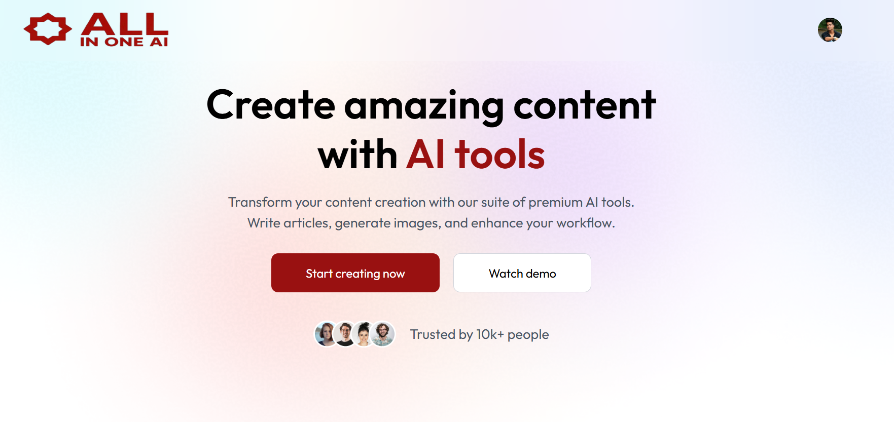
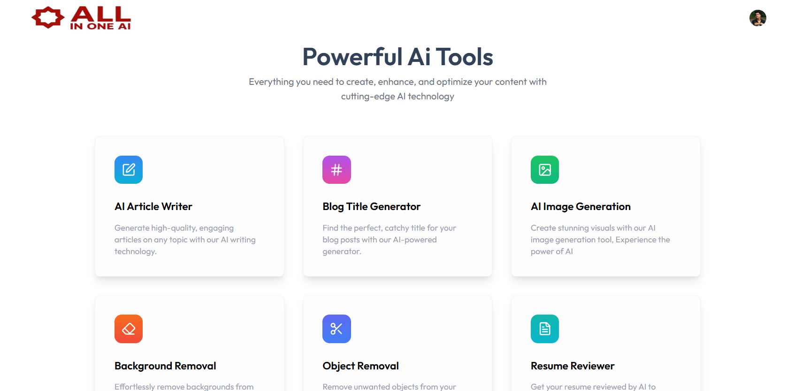
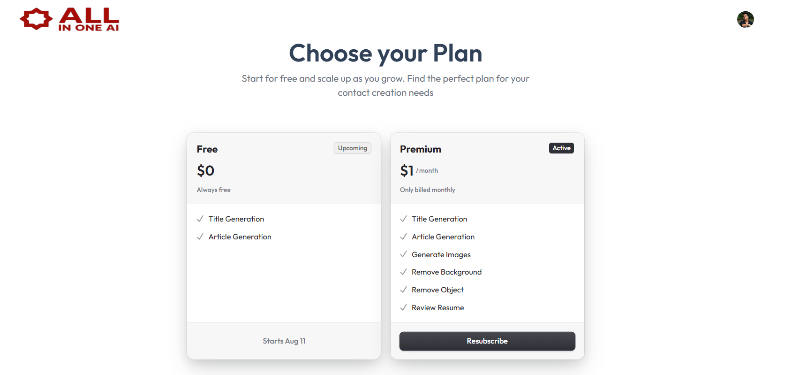
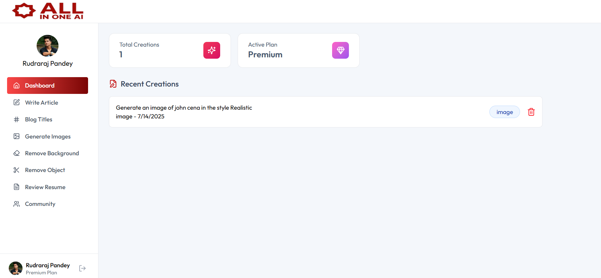
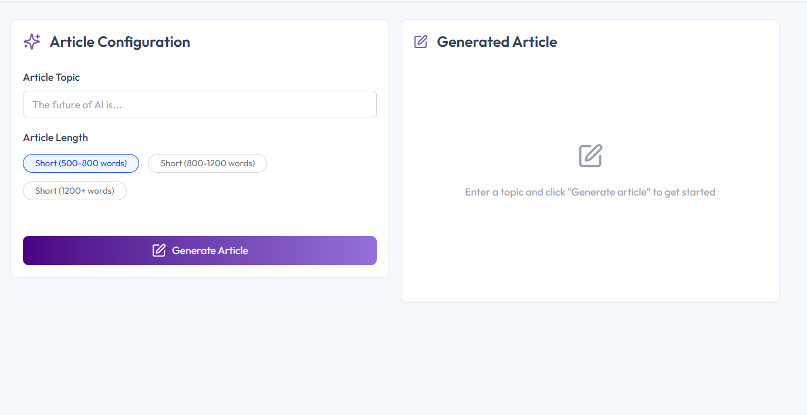
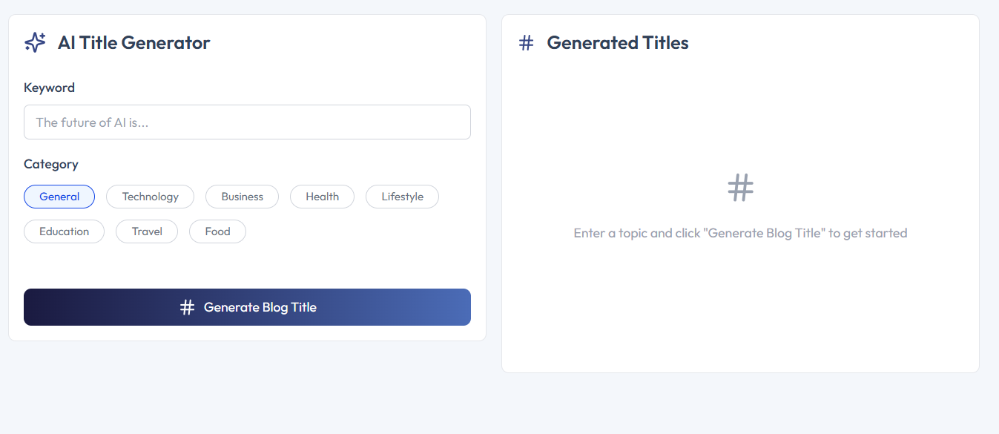
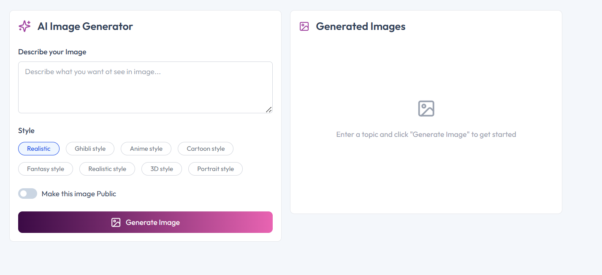
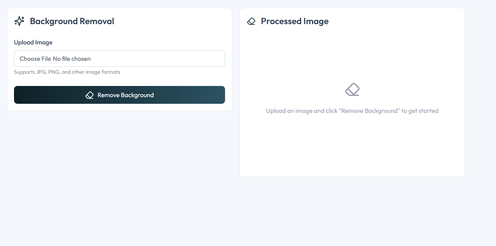
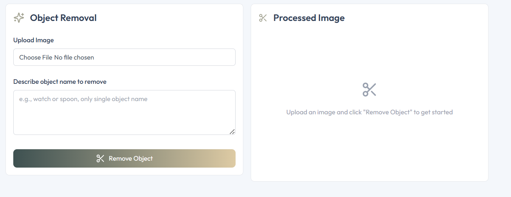
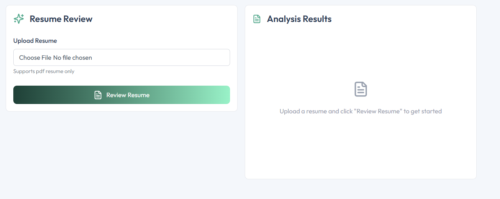

# **AI SaaS App**

An AI-powered full stack app that combines productivity and creativity tools — generate articles, images, remove objects/backgrounds, get resume feedback, and share your creations with the world.

 ---

 ## ✨ Features

- 📝 **Write Article** – Generate AI-written articles with adjustable lengths
- 💡 **Blog Titles** – Generate catchy blog titles from prompts
- 🎨 **Generate Image** – Create AI-generated images from text
- 🧽 **Remove Background** – Instantly remove background from images
- ✂️ **Remove Object** – AI-based object removal from images
- 📄 **Review Resume** – AI-powered resume analysis
- 📚 **Dashboard** – View, manage, and delete all your creations
- 🌐 **Community Page** – View published creations and like others’ work

---

## 🧰 Tech Stack

- **Frontend**: React, Tailwind CSS, Clerk (auth)
- **Backend**: Node.js, Express, PostgreSQL (NeonDB), Clerk, OpenAI Gemini, Cloudinary
- **Hosting**: Vercel (frontend & backend), NeonDB

---

### 🔐 Landing Page  

### 🧾 Dashboard  

### 📝 Write Article  

### 🧠 Blog Titles  

### 🖼️ Generate Image  

### 🪄 Remove Background  

### 🎯 Remove Object  

### 📄 Resume Review  

